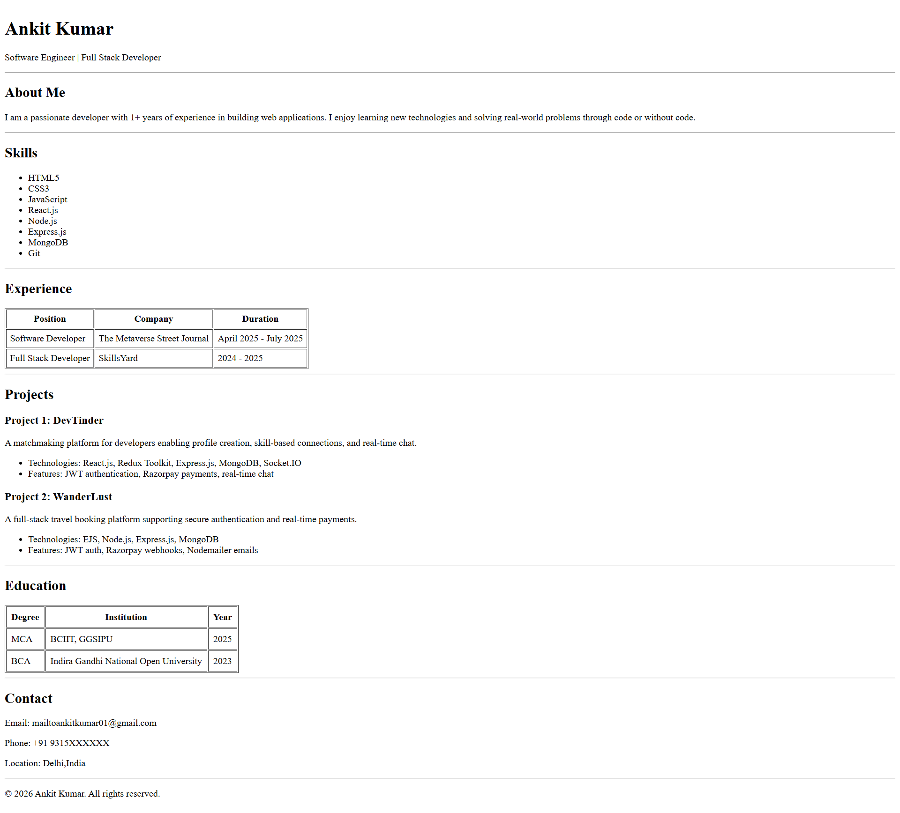

# HTML Resume Page

This project is a single-page resume website created using **only HTML**.

The purpose of this assignment is to demonstrate correct usage of HTML structure, semantic tags, and clean, readable layout without using CSS or JavaScript.

---

## Project Overview

- Single-page resume website
- Built using pure HTML
- Focuses on structure and semantics

---

## Technologies Used

- HTML5

---

## Sections Included

- Header (Name and Role)
- Professional Summary
- Skills
- Experience
- Projects
- Education
- Contact Information

---

## How to Run the Project

1. Clone the repository:
   ```bash
   git clone https://github.com/AnkitKumarHub/Assignment-Resume.git

2. Open the project folder 
3. Open the resume.html file in any web browser


## Live Preview 

https://assignment-resume.vercel.app/

---

## Screenshot 



